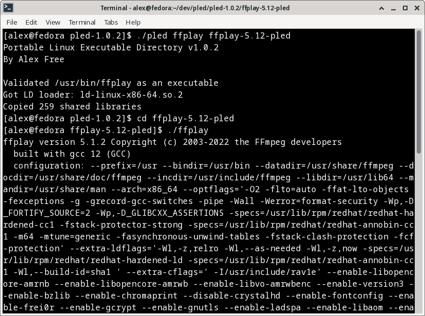
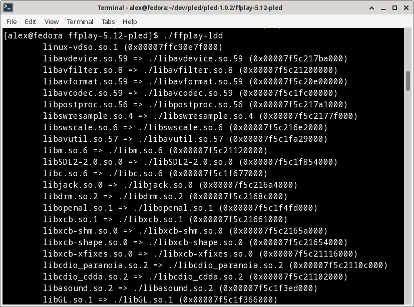

# Portable Linux Executable Directory

_By Alex Free_

Release dynamically linked Linux executables with 'Windows-like software portability'. On Windows it is common for software to be distributed as an executable in it's own folder, which also contains any dynamically linked libraries. This ensures it can 'run anywhere`. You can do this on Windows because the library linker searches the directory that the executable file is in for the dynamic libraries it needs to run (which Linux does not do). This behavior is very desirable an OS such as Linux. Packaging software for Linux can become a nightmare quickly when dynamic libraries are involved. 

PLED is designed to make releasing Linux software easy and accessible by bringing the same Windows behavior and ideas to Linux. The PLED version of a Linux executable should run on any Linux distribution if the CPU architecture is the same (and it's not an extreme version difference in kernel version). This is because the PLED version is a directory containing all dynamically linked shared libraries, the LD loader itself used by the OS to load said dynamically linked libraries, and a wrapper which executes the real original Linux executable using the included LD loader and self-contained shared libraries all in the same directory.

## External Links

*   [Homepage](https://alex-free.github.io/pled) 
*   [GitHub](https://github.com/alex-free/pled)

## Table Of Contents

*   [Downloads](#downloads)
*   [Usage](#usage)
*   [The PLED Advantage](#the-pled-advantage)
*   [Requirements For Portability](#requirements-for-portability)
*   [PLED In The Wild](#pled-in-the-wild)
*   [License](#license)

## Downloads

### v1.0.4 (3/28/2023)

[PLED v1.0.4](https://github.com/alex-free/pled/releases/download/v1.0.4/pled-v1.0.4.zip)

Changes:

*   Fixed bug where some stranger shared library paths that included some relativeness were not being copied (bug found from pleding [p7zip](https://github.com/p7zip-project/p7zip)'s 7za).

[About previous versions](changelog.md).

## Usage

PLED expects 2 arguments. The first is the full executable file path or the name of a command in your `$PATH` (the one that you want to make portable). The second is the full path to the output `pled` (the directory which will contain the portable version of the executable file referenced in the first argument).

`./pled git git-2.39-pled`

`./pled /usr/bin/git git-2.39-pled`

May be used to achieve the exact same end result, which is  a `git-2.39-pled` directory which provides a usable `git` command portable between various Linux distros and versions. The `git-2.39-pled` directory generated by the example above contains:

*   The `git` executable itself, however it is renamed to `git2` in the `git-pled` directory.
*   The `git` wrapper generated by PLED which executes `git2` with the ld loader and shared libraries in the `git-2.39-pled` directory.
*   The `git-ldd` script, which correctly displays the shared library linkage of the `git` PLED wrapper.

## The PLED Advantage

There are many different ways to release portable Linux software, such as by using [Docker](https://www.docker.com/), [AppImage](https://appimage.org/), or [Snap](https://snapcraft.io/). Why use PLED over these?

*   PLED is as simple as it gets. There is no VM or sandbox involved.

*   PLED doesn't need a package manager, or any other existing system infrastructure to work. There is nothing you need to 'install' to use 'pled' binaries on a Linux system. It's just bash scripts.

## Requirements For Portability

### Real Dynamically Linked Executable File

PLED **requires an actual executable file as the first argument and NOT a shell-script wrapper**. Some software installed by your package manager may actually be a shell script wrapper, but be presented as the executable. PLED will refuse to function on such a shell script wrapper, as it verifies if the first argument is an actual executable file. If PLED finds this not to be the case, it will helpfully offer to display the shell script wrapper's contents to help you figure out where the real executable is. This is a good start, but typically it may be easier to just recompile the target software entirely yourself, figure out the configuration and any required external files, and then go from there. 

### External Resource Files

Many executables may expect explicit filepaths to things like config files, databases, etc. PLED has no way of knowing about any such files that the executable may need to run correctly and as intended. When making a program portable with PLED, it is important to figure out how to set the program to use portable, self-contained resource files such as these. Compiling a program from scratch is sometimes the easiest way to accomplish this.

### Executables Which Load Dynamic Libraries Themselves

Some executables may themselves load dynamic libraries that are not linked explicitly be instead using executable code. This is different then what normally happens, which is the ld loader loads all the linked libraries using info derived from executable itself (which is how PLED finds dynamic libraries). 

One such example is the [Firefox](https://bugs.launchpad.net/ubuntu/+source/firefox/+bug/1017964) executables found in most package managers. The Firefox executable loads a bunch of dynamic libraries named in an [external resource file](#external-resource-files) (`dependentlibs.list`) in the executable code itself. This prevents PLED from making such an executable portable as all dynamic libraries can not be accounted for automatically.

### Debugging PLED Executables

One way you can debug a program in regards [external resource files](#external-resource-files) or [loading dynamic libraries using executable code](#executables-which-load-dynamic-libraries-themselves) is by using [Strace](https://strace.io/) (the Linux syscall tracer). In the output `pled` directory you can compare the output of `strace ./yourbinary` and `strace ./yourbinary2` (the actual executable the wrapper executes).

## PLED In The Wild

I have used PLED myself in my other projects to make portable linux builds a reality, such as:

*   [Video2DreamcastDisc](https://alex-free.github.io/video2dreamcastdisc)
*   [Dreamcast CDI Burner](https://alex-free.github.io/dcdib)
*   [CDRDAO-PLED](https://alex-free.github.io/cdrdao)

## License

PLED is released into the public domain, see the file [unlicense.md](unlicense.md) for more info.